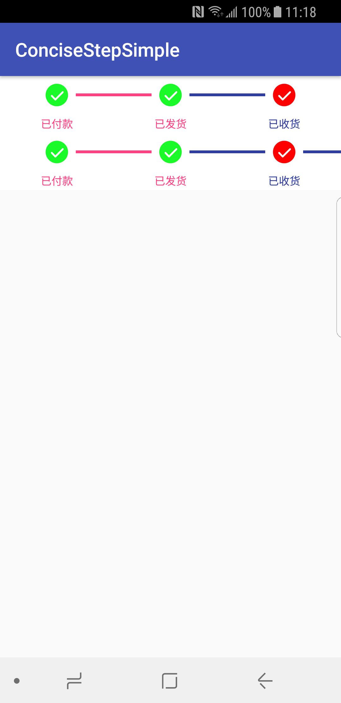
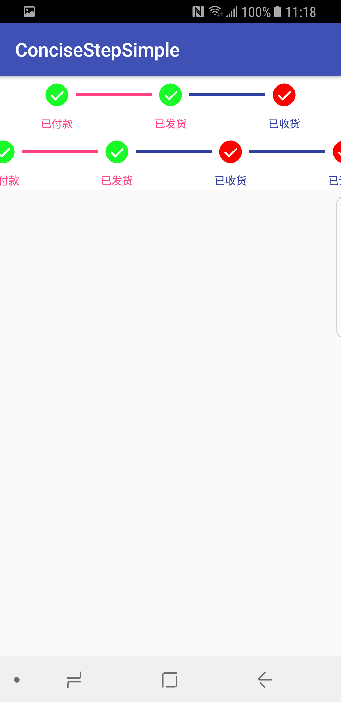

# ConciseStepView
## 一行链式代码，解决StepView



# How to
## To get a Git project into your build:
### Step 1. Add the JitPack repository to your build file
### Add it in your root build.gradle at the end of repositories:
``` 
allprojects {
  repositories {
    ...
    maven { url 'https://jitpack.io' }
  }
}
```
### Step 2. Add the dependency
```
dependencies {
    implementation 'com.github.deilsky:ConciseStepView:v1.0'
}
```
### Step3.Used
```
xml
    <HorizontalScrollView
        android:id="@+id/stepView"
        android:layout_width="match_parent"
        android:layout_height="60dp" />
代码
HorizontalScrollView scrollView = findViewById(R.id.stepView);
private ArrayList<ConciseData> data = new ArrayList<ConciseData>();
ConciseData conciseData;
conciseData = new ConciseData();
conciseData.setId(1);
conciseData.setFinish(true);
conciseData.setName("已付款");
data.add(conciseData);

conciseData = new ConciseData();
conciseData.setId(2);
conciseData.setFinish(true);
conciseData.setName("已发货");
data.add(conciseData);

conciseData = new ConciseData();
conciseData.setId(3);
conciseData.setFinish(false);
conciseData.setName("已收货");
data.add(conciseData);

conciseData = new ConciseData();
conciseData.setId(4);
conciseData.setFinish(false);
conciseData.setName("已评价");
data.add(conciseData);

conciseData = new ConciseData();
conciseData.setId(5);
conciseData.setFinish(false);
conciseData.setName("已完成");
data.add(conciseData);

ConciseStepView stepView = ConciseStepView.create().attach(scrollView)
        .defaults(R.color.colorPrimaryDark, R.color.colorPrimaryDark, R.drawable.ic_radio_unchecked)
        .currents(R.color.colorAccent, R.color.colorAccent, R.drawable.ic_radio_checked)
        .stepViewWidth(360)
        .stepLineHeight(3)
        .stepTextSize(12)
        .steps(data1).setOnStepClickListener(new ConciseStepView.OnStepClickListener() {
            @Override
            public void onStepClick(ConciseData data) {
                Log.d("onStepClick", data.toString());
                Toast.makeText(getApplicationContext(), data.toString(), Toast.LENGTH_SHORT).show();
            }
        });
stepView.build();
```

[](https://jitpack.io/#deilsky/ConciseStepView)
